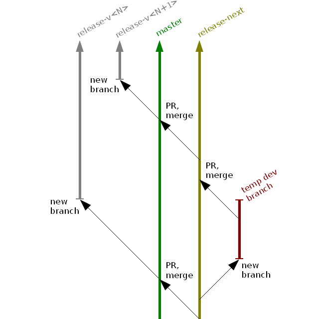

# Contents

1. [Contributors](#1-contributors)<br/>
1.2. [Roles](#12-roles)<br/>
2. [Versions](#2-versions)<br/>
2.1. [Backward Compatibility](#21-backward-compatibility)<br/>
2.2. [Numbers](#22-numbers)<br/>
3. [Issues](#3-issues)<br/>
3.1. [States](#31-states)<br/>
3.2. [Defects Priority](#32-defects-priority)<br/>
3.3. [Specific Properties](#33-specific-properties)<br/>
4. [Continuous Integration](#7-continuous-integration)<br/>
4.1 [Testing](#4-testing)<br/>
4.1.1. [Unit Tests](#411-unit-tests)<br/>
4.1.2. [Integration Tests](#412-integration-tests)<br/>
4.1.3. [System Tests](#413-system-tests)<br/>
4.1.3.1. [Containerized Tests](#4131-containerized-tests)<br/>
4.2. [Releasing](#42-releasing)<br/>
5. [Code](#6-code)<br/>
5.1. [Branching](#61-branching)<br/>
5.2. [Style](#62-style)<br/>
5.3. [Exception Handling](#63-exception-handling)<br/>
5.4. [Performance](#64-performance)<br/>

# 1. Contributors

* [Andrey Kurilov](https://github.com/akurilov)
* Gennady Eremeev
* [Ilya Kisliakovsky](https://github.com/kisliakovsky)
* [Kirill Gusakov](https://github.com/gusakk)
* Mikhail Danilov
* [Mikhail Malygin](https://github.com/aphreet)
* [Olga Zhavzharova](https://github.com/Zhavzharova)
* [Veronika Kochugova](https://github.com/veronikaKochugova)

# 1.2. Roles

| Name | Responsibilities | Current Assignees
|------|------------------|------------------
| User | Report the issues | Definitely unknown
| Developer | <ul><li>Development</li><li>Testing</li><li>Automation</li><li>Documentation</li></ul> | <ul><li>Veronika Kochugova</li><li>Andrey Kurilov</li><ul>
| Owner | <ul><li>The next version scope definition</li><li>Roadmap definition</li><li>User interaction</li></ul> | Andrey Kurilov
| Manager | The explicit scopes approval | ********

# 2. Versions

## 2.1. Backward Compatibility

The following interfaces are mentioned as the subject of the backward compatibility:
1. Input (item list files, scenario files, configuration options)
2. Output files containing the metrics
3. API

## 2.2. Numbers

Mongoose uses the [semantic versioning](http://semver.org/). This means that the ***X.Y.Z*** version notation is used:

* ***X***<br/>
    Major version number. Points to significant design and interfaces change. The *backward compatibility* is **not
    guaranteed**.
* ***Y***<br/>
    Minor version number. The *backward compatibility* is guaranteed.
* ***Z***<br/>
    Patch version number. Includes only the defect fixes.

# 3. Issues

Types:
* Defect
* Story
* Task
* Sub-task

| Type     | Description |
|----------|-------------|
| Defect   | The defect/bug which **affects the released version** (the type "Task" should be used if a defect/bug affects the version which is not released yet) |
| Story    | High-level use case or a long-term activity aspect (testing, performance, etc) |
| Task     | A task which couldn't be included into any defect/story |
| Sub-task | A task which could be included into a defect/story |

Tracker link: https://mongoose-issues.atlassian.net/projects/BASE

## 3.1. States

| State       | Description |
|-------------|-------------|
| OPEN        | All new issues should have this state. The issues are selected from the set of the *OPEN* issues for the proposal and review process. The task is updated w/ the corresponding comment but left in the *OPEN* state if it's considered incomplete/incorrect. Also incomplete/incorrect issue should be assigned back to the reporter.
| PROPOSED    | The issue is selected for the approval by the *manager*.
| DEFERRED    | Manager has approved the issue to be processed after the next major/minor (non-patch) version is released.
| ACCEPTED    | Manager approved the issue to be processed before the next major/minor (non-patch) version is released.
| ESCALATED   | Critical defect which interrupts all *DEFERRED*/*ACCEPTED* issues processing. Causes the new *patch* version release ASAP.
| IN PROGRESS | The issue is in progress currently
| RESOLVED    | Issue is done and the corresponding changes are merged into the `integration` branch.
| CLOSED      | Issue is done and the corresponding changes are merged into the `master` branch (= version release, availability for the user).

**Note**:
> The corresponding impact probability/frequency is not taken into account in the process currently. For example, all
> defects are assumed to be equally frequently occurring and affecting same users, regardless the particular
> scenario/use case. This approach is used due to the lack of the sufficient statistical information about the Mongoose
> usage.

## 3.2. Defects Priority

| Priority     | Conditions | Target state as a result of the review
|--------------|------------|---------------------------------------
| Critical     | No workaround available **and** any of the following: <ul><li>Crash</li><li>Hang</li><li>Not functioning</li><li>Functioning incorrectly</li><li>Performance degradation</li></ul> | `ESCALATED`
| Non-critical | Not *critical* **and** not *minor* | `ACCEPTED` (for the next minor/major version)
| Minor        | Any of the following: <ul><li>Usability issue</li><li>Cosmetic</li></ul> | `OPEN` or `ACCEPTED`

## 3.3. Specific properties

| Name                  | Applicable Issue Types | Who is responsible to specify  | Notes
|-----------------------|------------------------|--------------------------------|-------|
| Affected version      | Defect                 | Reporter: user/developer/owner | Only the *latest* version may be used for the defect reporting. The issue should be *rejected* if the reported version is not *latest*.
| Branch                | Defect, Task, Sub-task | Reviewer: developer/owner      |
| Description           | Task, Sub-task         | Reporter: user/developer/owner |
| Expected behaviour    | Defect                 | Reporter: user/developer/owner | The reference to the particular documentation part describing the expected behavior is preferable.
| Fix version           | Defect, Task, Sub-task | Reviewer: developer/owner      |
| Limitations           | Story                  | Reviewer: developer/owner      |
| Observed behaviour    | Defect                 | Reporter: user/developer/owner | Error message, errors.log output file, etc.
| Pull request          | Defect, Task, Sub-task | Reviewer: developer/owner      |
| Resolution commit     | Defect, Task, Sub-task | Reviewer: developer/owner      |
| Root cause            | Defect                 | Reviewer: developer/owner      |
| Start command/request | Defect                 | Reporter: user/developer/owner | Leave only the essential things to reproduce: try to check if possible if the bug is reproducible w/o distributed mode, different concurrency level, item data size, etc.
| Scenario              | Defect                 | Reporter: user/developer/owner | Don't clutter with large scenario files. Simplify the scenario leaving only the essential things.
| Steps                 | Defect                 | Reporter: user/developer/owner |
| Purpose               | Story                  | Reporter: user/developer/owner | Which particular problem should be solved with Mongoose? The links to the related documents and literature are encouraged.
| Requirements          | Story                  | Reporter: user/developer/owner | Both functional and performance requirements are mandatory. Optionally the additional requirements/possible enhancements may be specified.

# 4. Continuous Integration

https://travis-ci.org/emc-mongoose/mongoose

## 4.1. Testing

### 4.1.1. Unit Tests

```bash
./gradlew clean test
```

### 4.1.2. Integration Tests

```bash
./gradlew clean integrationTest
```

### 4.1.3. System Tests

The system tests use the [JUnit parameterization](https://github.com/junit-team/junit4/wiki/Parameterized-tests). The parameter values are taken from the environment. The list of the system tests parameters below:

| Parameter Name | Acceptable Values                      | Values Meaning
|----------------|----------------------------------------|----------------
| STORAGE_TYPE   | s3, atmos, fs, swift                   | (the same)
| RUN_MODE       | local, distributed                     | 1, 2
| CONCURRENCY    | unlimited, single, small, medium, high | 0, 1, 10, 100, 1000
| ITEM_SIZE      | empty, small, medium, large, huge      | 0, 10KB, 1MB, 100MB, 10GB

To run the system tests for the particular case use the commands like
below:

```bash
export MONGOOSE_VERSION=testing
export STORAGE_TYPE=s3
export RUN_MODE=distributed
export CONCURRENCY=medium
export ITEM_SIZE=small
./gradlew clean systemTest --tests com.emc.mongoose.system.CircularAppendTest
```

Note that some system tests will not run for some parameter values. The acceptable parameter values are declared explicitly in the `.travis.yml` file.

#### 4.1.3.1. Containerized Tests

Since v4.0.0 all system tests are containerized. To run a system test locally it's necessary to
prepare 3 testing Docker images manually:

```bash
docker build \
    -f docker/Dockerfile \
    -t emcmongoose/mongoose:testing \
    .
docker push emcmongoose/mongoose:testing
```

```bash
docker build \
    --build-arg MONGOOSE_VERSION=testing \
    -f docker/Dockerfile.scripting-groovy \
    -t emcmongoose/mongoose-scripting-groovy:testing \
    .
docker push emcmongoose/mongoose-scripting-groovy:testing
```

```bash
docker build \
    --build-arg MONGOOSE_VERSION=testing \
    -f docker/Dockerfile.scripting-jython \
    -t emcmongoose/mongoose-scripting-jython:testing \
    .
docker push emcmongoose/mongoose-scripting-jython:testing
```

Also it's necessary to supply the testing image version to the system
test via environment variable `MONGOOSE_VERSION`:

```bash
export MONGOOSE_VERSION=testing
export STORAGE_TYPE=atmos
export RUN_MODE=distributed
export CONCURRENCY=medium
export ITEM_SIZE=small
./gradlew clean systemTest --tests com.emc.mongoose.system.CreateNoLimitTest
```

### 4.1.4. Endurance Tests

```bash
export MONGOOSE_VERSION=testing
export STORAGE_TYPE=swift
export RUN_MODE=distributed
export CONCURRENCY=unlimited
export ITEM_SIZE=large
./gradlew clean enduranceTest --tests com.emc.mongoose.endurance.ParallelPipelineAndInfiniteLoopTest
```

## 4.2. Releasing

1. Ensure all tests are OK
2. Ensure the new version documentation is ready
3. Create the corresponding version branch `release-v<X>.<Y>.<Z>` and set the version in the configuration to
   <X>.<Y>.<Z>
4. Share the testing build with QE and repeat this step until the qualification is OK
5. Create/replace the corresponding VCS tags:
   ```bash
   git tag -d latest
   git push origin :refs/tags/latest
   git tag -a <X>.<Y>.<Z> -m <X>.<Y>.<Z>
   git tag -a latest -m <X>.<Y>.<Z>
   git push --tags --force
   ```
6. Create the pull request to the `master` branch
7. Merge the pull request if reviewed and approved
   *Note*:
   > This is a no-return point. Making any further changes will require a new version!
8. Upload the artifacts to the Central Maven repo:
   1.
    ```bash
    ./gradlew clean uploadArchives
    ```
   2. Go to the https://oss.sonatype.org/#stagingRepositories find the corresponding repository, close and then release
      it.
9. Update the projects depending on the Mongoose's API (storage drivers, at least)

# 5. Code

## 5.1. Branches

The branching rules in the Mongoose project are simple:

1. There's a separate "archive" branch for each release with name "release-vX.Y.Z" where "X.Y.Z" is a version number.
2. The integration branch is named "integration". All feature PRs should base on the integration branch.
3. The PR/merge to the master branch is performed when the release decision is made (all tests are ok, documentation is added, etc).

## 5.2. Style

* Indent code with TAB having width of 4 characters
* Code line width: 120 characters
* If interface is named `Foo` then:
  * Abstract implementation should be named as `FooBase`
  * Default concrete implementation should be names as `FooImpl`
* Any field/local variable should be *final* if possible

## 5.3. Exception Handling

The threads are not used in the usual way (*fibers* are used instead for the multitasking purposes). Therefore, having
an `InterruptedException` thrown means that the run was interrupted externally. To stop the run, it's necessary to pass
the specific exception to the uppermost level of the call stack. However, the `InterruptedException` is a checked
exception and usually couldn't be passed outward. The specific unchecked `InterruptRunException` is used for this
purpose. This imposes the restrictions on the exceptions handling:

* If the `InterruptedException` is caught the `InterruptRunException` should be thrown:
    ```java
    try {
        foo(); // may throw an InterruptedException
    } catch(final InterruptedException e) {
        throw new InterruptRunException(e);
    }
    ```

* The following exceptions catching should be avoided as far as the `InterruptRunException` may be swallowed
occasionally:
    1. `Throwable`
    2. `Exception`
    3. `RuntimeException`

## 5.4. Performance
Take care about the performance in the ***critical*** places:
* Avoid *frequent* objects instantiation
* Avoid unnecessary *frequent* allocation
* Avoid *frequent* method calls if possible
* Avoid deep call stack if possible
* Avoid I/O threads blocking
* Avoid anonymous classes in the time-critical code
* Avoid non-static inner classes in the time-critical code
* Use thread locals (encryption, string builders)
* Use buffering, buffer everything
* Use batch processing if possible
