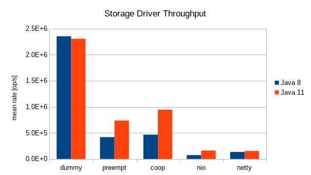
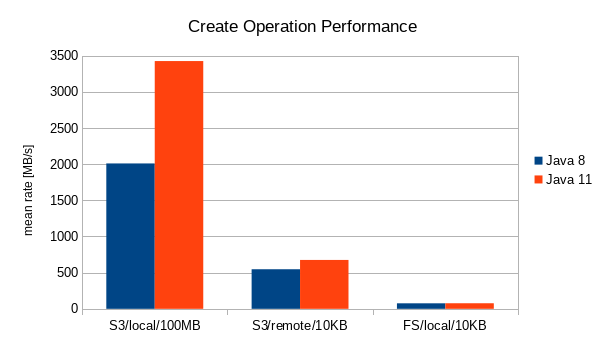

# Migration to Java 11

## Motivation

Mongoose had been using Java 8 for both build environment and runtime for a long time.
However, Java 8 is getting close to its [EOL](https://www.oracle.com/technetwork/java/java-se-support-roadmap.html).
On the other hand, the new Java versions include the features which are very useful for the developers and users. Few
examples:

| JEP # | Application |
|---|---|
| 282 | Allows to build the custom JRE without uneccessary components and downsize the resulting distributable image
| 286 | Allows the developers to produce cleaner code
| 307 | GC performance improvement
| 312 | Performance improvement

## Performance

Environment:
* Virtual
* OS: Linux 3.10.0-862.6.3.el7.x86_64 (CentOS)
* Memory: 10GB
* CPU: 8 cores, Intel(R) Xeon(R) CPU E5-2690 v4 @ 2.60GHz

### Storage Drivers Internal

The load ooperations processing rate is improved in the most cases (from -2 % up to +119 %).

### End User

For the end user performance case the real storage had been used (S3 either FS). The concurrency limit was equal to 100
and the mean I/O byte rate was measured. The mean I/O byte rate is improved in all cases (from +1,25 % up to +70,39 %)

