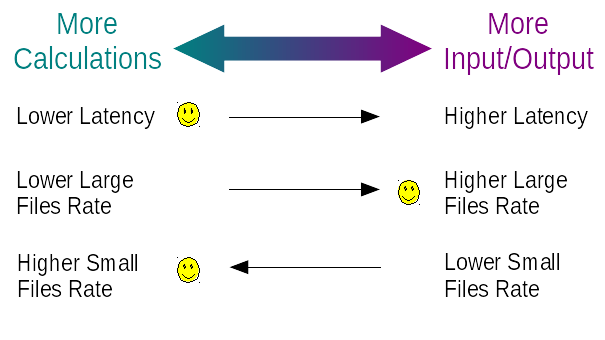

# Contents

1. [Basic Terms](#1-basic-terms) 
2. [Components](#2-components) 
2.1. [Storage Driver](#21-storage-driver) 
2.2. [Load Generator](#22-load-generator) 
2.3. [Load Step Context](#23-load-step-context) 
2.4. [Metrics Manager](#24-metrics-manager) 
3. [Concurrency](#3-concurrency) 
3.1. [Service Tasks](#31-service-tasks) 
3.2. [Load Operations](#32-load-operations) 
3.2.1. [NIO Storage Driver Derivatives](#321-nio-storage-driver-derivatives) 
3.2.2. [Netty-based Storage Drivers](322-netty-based-storage-drivers) 
3.2.3. [Preemptive Storage Driver Derivatives](#323-preemptive-storage-driver-derivatives) 
3.3. [Tuning](#32-tuning) 

# 1. Basic Terms

* **Storage**

  A storage which performance is been measured in the *test*. Currently
  several types of storages are supported.

* **Item**

  The unit to account the performance rates. Maybe a file, object,
  directory, bucket, etc. An *Item* has the identifier property (name).

* **Data Item**

  An *Item* with a data payload. Any *Data Item* has the corresponding
  size property.

* **Item Input**

  The readable source of the items. This may be a CSV file, a binary
  stream, a collection or a bucket listing.

* **Item Output**

  The writable destination for the items. This may be a CSV file, a
  binary stream or a collection.

* **Load Operation**

  A load operation is a item linked with a particular operation type (write/read/delete/etc). Also, any operation has
  the state and the execution result as an extension of this state.

* **Load Step**

  Load step is an unit of test execution flow.

* **Load Step Context**

  Load step is an unit of metrics reporting. A Load Step may include several Load Step Contexts.

* **Scenario**

  A set of load steps combined and organized using flow elements
  provided by a scripting engine which supports JSR-223. Mongoose
  invokes the default scenario if no custom scenario is specified. The
  default scenario just runs the single *linear* load step.

* **Entry Node**

  In the distributed mode the node which is used to execute a scenario is a *entry node*

* **Additional Node**

  In the distributed mode, the *additional nodes* are used to execute a scenario steps together with entry node

# 2. Components

## 2.1. Storage Driver

Executes the *load operation*s generated by *Load Generator*s. The basic property is the concurrency level and storage
client configuration. The functionality includes:

* Low-level implementation of the operations execution functionality
* Rate limit related things
* Callbacks for the completed operations

## 2.2. Load Generator

Load Generator is a component which generates the operations from the items got from the input. Many storage drivers may
be associated with a load generator. The basic properties are:

* Origin Index (all operations generated share the same origin index)
* Operation type (create/read/etc)
* Shared rate throttle
* Shared weight throttle
* Storage drivers list
* Storage drivers balancer

## 2.3. Load Step Context

A load step context is an unit of test step control. Functionality:

* Execution control (timeouts handling, shutdown invocations, etc)

## 2.4. Metrics Manager

Metrics aggregation and representation. The component is a singleton which was differentiated from the Load Step Context
component. Many load step contexts may be associated with the single metrics manager.

# 3. Concurrency

Mongoose uses fixed count of threads to execute its tasks.

1. Calculate the asynchronously changing values defined by a pattern in the configuration
2. Generate the operations
3. Distribute the generated operations among the storage drivers uniformly
4. Storage drivers dispatch the incoming operations
5. Storage drivers perform the file/socket I/O
6. Load step context collects the actual concurrency measurements from the storage drivers
7. Load step context collects the completed operations results from the storage drivers
8. Refresh the registered metrics and their snapshots

The count of the tasks which are required to be executed concurrently may be large (for example in a case of distributed
mode with many additional nodes). The traditional thread-per-task approach is inefficient if the count of the threads is
much higher than the count of the available CPU cores. The [fibers](https://github.com/akurilov/fiber4j) are used in
Mongoose to execute the required work efficiently.

Mongoose tasks may be divided into two types: service tasks and load operations. So there are two different fixed thread
pools for these types of tasks.

## 3.1. Service Tasks

Each Mongoose process shares the global service tasks executor (FibersExecutor instance). By default the count of
the service tasks executor's threads is equal to the count of the available CPU cores. A user may set the different
count of these threads using the configuration option load-service-threads.

## 3.2. Load Operations

### 3.2.1. NIO Storage Driver Derivatives

The count of the concurrent load operations at is limited also by the `storage-driver-threads` configuration option
which is CPU core count by default. This means that operations will occupy no more I/O worker threads than configured.
However the operations are reentrant and the count of the active (started but not completed yet) operations may be much
more(may be limited by `storage-driver-limit-concurrency` configuration option).

### 3.2.2. Netty-based Storage Drivers

Netty uses its own I/O worker thread pool. The count of these threads is controlled by the `storage-driver-threads`
configuration option. However the connection pool allows to keep much more open connections at any moment of time. The
count of the open connections may be limited by `storage-driver-limit-concurrency` configuration option.

### 3.2.3. Preemptive Storage Driver Derivatives

Uses non-reentrant (thread-per-task) execution approach.

## 3.2. Tuning

Using more threads for "calculations" causes higher throughput (operations count per unit of time), higher
responsiveness (e.g. lower latency). However using more threads for I/O causes higher observable bandwidth (transferred
bytes count per unit of time), which is especially obvious while performing I/O on the large data items.

