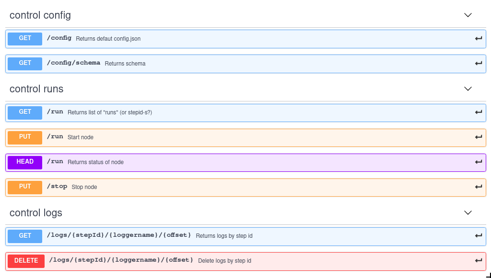

# Control API
Control used REST API.
### Configuring port
When you launch the Mongoose, a server set up that accepts control requests (Control API) and exports metrics ([Monitoring API](doc/interfaces/api/monitoring)).To configure the server port, the parameter `--run-port` is used. By default `--run-port=9999`.
### REST API
## Documentation for API Endpoints

All URIs are relative to https://app.swaggerhub.com/apis/veronikaKochugova/Mongoose-Control-API/0.0.1

## Documentation for Authorization

All endpoints do not require authorization.

