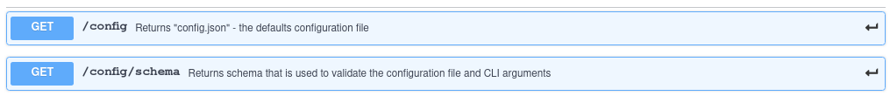

# Control API
Control used REST API.
### Configuring port
When you launch the Mongoose, a server set up that accepts control requests (Control API) and exports metrics ([Monitoring API](doc/interfaces/api/monitoring)).To configure the server port, the parameter `--run-port` is used. By default `--run-port=9999`.
## REST API

Control API is divided into 3 categories:

|Categorie|Requests|Description|
|---|---|---|
|Config API|<li>get config<li>get schema|Allows you to get the full configuration and scheme for this node|
|Runs API|<li>get list of runs<li>start new run<li>get status of run<li>stop run|Allows you to manage runs|
|Logs API|<li>get logs<li>delete logs|Allows you to manage logs of runs|

### Documentation for API Endpoints

All URIs are relative to https://app.swaggerhub.com/apis/veronikaKochugova/Mongoose-Control-API/0.0.1

> About [defaults and configuration](https://github.com/emc-mongoose/mongoose/tree/master/doc/usage/defaults)

All endpoints do not require authorization.

