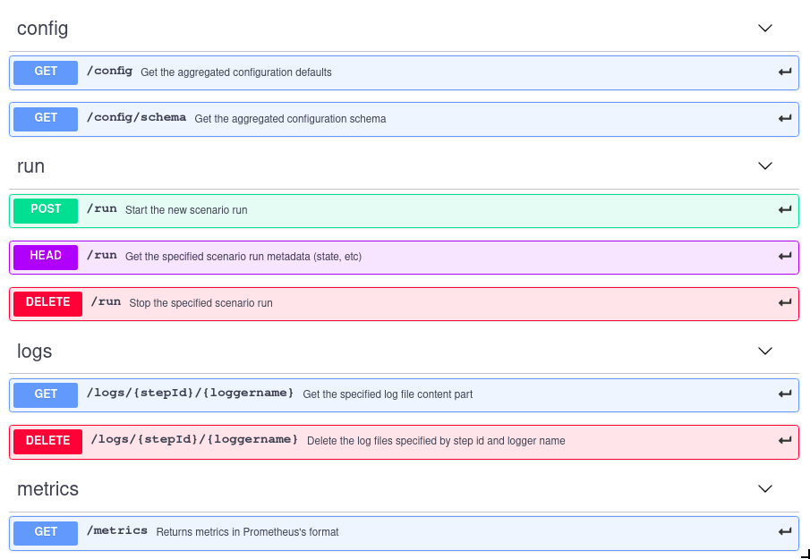

# Contents

1. [Configuring the port](#configuring-the-port)<br/>
2. [REST](#rest)<br/>
&nbsp;&nbsp;2.1. [Control API](#control-api)<br/>
&nbsp;&nbsp;&nbsp;&nbsp;2.1.1. [Config](#config)<br/>
&nbsp;&nbsp;&nbsp;&nbsp;2.1.2. [Run](#run)<br/>
&nbsp;&nbsp;&nbsp;&nbsp;2.1.3. [Logs](#logs)<br/>
&nbsp;&nbsp;2.2. [Monitoring API](#monitoring-api)<br/>
&nbsp;&nbsp;&nbsp;&nbsp;2.2.1. [Output format](#output-format)<br/>
&nbsp;&nbsp;&nbsp;&nbsp;2.2.2. [Example](#example)<br/>
3. [Usage](#usage)<br/>

# Configuring the port

When you launch the Mongoose, a server set up that accepts control requests ([Control API](#control-api)) and exports metrics
([Monitoring API](#monitoring-api)). To configure the server port, the parameter `--run-port` is used.
By default `--run-port=9999`.

# REST

Available requests:



See the full documentation [here](https://app.swaggerhub.com/apis-docs/veronikaKochugova/Mongoose/4.1.0)

## Control API

Control API is divided into 3 categories:

|Category|Requests|Description|
|---|---|---|
|Config API|<li>get config<li>get schema|Allows you to get the full configuration and scheme for this node|
|Runs API|<li>start new run<li>get status of run<li>stop run|Allows you to manage runs|
|Logs API|<li>get logs<li>delete logs|Allows you to manage logs of runs|

### Config

TODO

### Run

Start a new scenario run:
```bash
curl -v -X POST \
    -F defaults=@src/test/robot/data/aggregated_defaults.json \
    -F scenario=@src/test/robot/data/scenario_dummy.js \
    http://localhost:9999/run
```

If successful, the response will contain the ETag header with the hexadecimal timestamp (Unix epoch time):
```bash
...
< HTTP/1.1 202 Accepted
< Date: Mon, 26 Nov 2018 18:35:50 GMT
< ETag: 167514e6082
< Content-Length: 0
...
```

This ETag should be considered as a run id and may be used to check the run state (using HEAD request) either stop it
(using DELETE request). The `If-Match` header with the hexadecimal run id value should be used also:

Checking the run state:
```bash
curl -v -X HEAD -H "If-Match: 167514e6082" http://localhost:9999/run
...
< HTTP/1.1 200 OK
< Date: Mon, 26 Nov 2018 18:40:10 GMT
< Content-Length: 0
...
```

Stopping the run:
```bash
curl -v -X DELETE -H "If-Match: 167514e6082" http://localhost:9999/run
...
< HTTP/1.1 200 OK
< Date: Mon, 26 Nov 2018 18:41:26 GMT
< Content-Length: 0
```

### Logs

#### Get The Log File Page From The Beginning

```bash
curl http://localhost:9999/logs/123/com.emc.mongoose.logging.Messages
```

#### Get The Specified Log File Part

```bash
curl -H "Range: bytes=100-200" http://localhost:9999/logs/123/com.emc.mongoose.logging.Messages
r the type "dummy-mock"
2018-11-27T16:19:34,982 | DEBUG | LinearLoadStepClient | main | com.emc.mongoose.storage.driver.mock.DummyStorageDriverMock@6aecbb8d: shut down
2018-11-27T16:19:34,982 | DEBUG |
```

#### Delete Log File

```bash
curl -X DELETE http://localhost:9999/logs/123/com.emc.mongoose.logging.Messages
```


## Monitoring API
For real-time monitoring the metrics are exposed in the [Prometheus's](https://github.com/prometheus/client_java) format.

### Output format
Information about new metric starts with
`````
# HELP <hash code>
# TYPE <hash code> gauge
`````
*where `gauge` is the prometheus type of metrics.*

Format of the metric name : `<app name>_<metric name>_<agrigation type>`. All metrics are given in the [SI](https://prometheus.io/docs/practices/naming/#base-units).

There are 7 metrics: 
- duration, 
- latency, 
- concurrency, 
- successful operation count, 
- faild operation count, 
- transfered size in bytes (BYTE)
- elapsed time.

and 3 Primitive Types: Timing, Rate, Concurrency. Depends on the type of metric, which aggregation types are exported. The table below provides a description:
  
  <table>
    <thead>
        <tr>
            <th>Metric name</th>
            <th>Primitive type</th>
            <th>Aggregation types</th>
        </tr>
    </thead>
    <tbody>
        <tr>
            <td>Duration</td>
            <td rowspan=2>Timing</td>
            <td rowspan=2> <ul><li>count<li>sum<li>mean<li>min<li>max<li>quntile_'value' (<a href="#quantiles">configured</a>)<ul> </td>
        </tr>
        <tr>
            <td>Latency</td>
        </tr>
        <tr>
            <td>Concurrency</td>
            <td>Concurrency</td>
            <td><ul><li>mean<li>last</td>
        </tr>
        <tr>
            <td>Bytes</td>
            <td rowspan=3>Rate</td>
            <td rowspan=3> <ul><li>count<li>sum<li>meanRate<li>lastRate<ul> </td>
        </tr>
         <tr>
            <td>Success</td>
        </tr>
        <tr>
            <td>Fails</td>
        </tr>
        <tr>
            <td>Elapsed time</td>
            <td>Gauge</td>
            <td>value</td>
        </tr>
    </tbody>
</table>

#### Quantiles
To specify the value of the required quantiles, use the `--output-metrics-quantiles` parameter. By default `--output-metrics-quantiles=0.25,0.75`. *This feature affects the output on the server and does not affect the logs and console.*

#### Labels
In braces exported load step parameters:

|Label name|Configured param|Type|
|:---|:---|---|
|`load_step_id`|load-step-id|string|
|`load_op_type`|load-op-type|string, [takes one of these values](https://github.com/emc-mongoose/mongoose/tree/master/doc/usage/load/operations/types#load-operation-types)|
|`storage_driver_limit_concurrency`|storage-driver-limit-concurrency|integer|
|`node_count`|*count of addrs in* load-step-node-addrs|integer|
|`item_data_sizw`|item-data-size|string with the unit suffix (KB, MB, ...)|

#### Example:

````````````````````````````````
# HELP 379303133 
# TYPE 379303133 gauge
mongoose_duration_count{load_step_id="ExposedMetricsTest",load_op_type="CREATE",storage_driver_limit_concurrency="0",node_count="1",item_data_size="10KB",} 10.0
mongoose_duration_sum{load_step_id="ExposedMetricsTest",load_op_type="CREATE",storage_driver_limit_concurrency="0",node_count="1",item_data_size="10KB",} 11.0
mongoose_duration_mean{load_step_id="ExposedMetricsTest",load_op_type="CREATE",storage_driver_limit_concurrency="0",node_count="1",item_data_size="10KB",} 1.1
mongoose_duration_min{load_step_id="ExposedMetricsTest",load_op_type="CREATE",storage_driver_limit_concurrency="0",node_count="1",item_data_size="10KB",} 1.1
mongoose_duration_quantile_0.25{load_step_id="ExposedMetricsTest",load_op_type="CREATE",storage_driver_limit_concurrency="0",node_count="1",item_data_size="10KB",} 1.1
mongoose_duration_quantile_0.5{load_step_id="ExposedMetricsTest",load_op_type="CREATE",storage_driver_limit_concurrency="0",node_count="1",item_data_size="10KB",} 1.1
mongoose_duration_quantile_0.75{load_step_id="ExposedMetricsTest",load_op_type="CREATE",storage_driver_limit_concurrency="0",node_count="1",item_data_size="10KB",} 1.1
mongoose_duration_max{load_step_id="ExposedMetricsTest",load_op_type="CREATE",storage_driver_limit_concurrency="0",node_count="1",item_data_size="10KB",} 1.1
# HELP 379303133 
# TYPE 379303133 gauge
mongoose_latency_count{load_step_id="ExposedMetricsTest",load_op_type="CREATE",storage_driver_limit_concurrency="0",node_count="1",item_data_size="10KB",} 10.0
mongoose_latency_sum{load_step_id="ExposedMetricsTest",load_op_type="CREATE",storage_driver_limit_concurrency="0",node_count="1",item_data_size="10KB",} 10.0
mongoose_latency_mean{load_step_id="ExposedMetricsTest",load_op_type="CREATE",storage_driver_limit_concurrency="0",node_count="1",item_data_size="10KB",} 1.0
mongoose_latency_min{load_step_id="ExposedMetricsTest",load_op_type="CREATE",storage_driver_limit_concurrency="0",node_count="1",item_data_size="10KB",} 1.0
mongoose_latency_quantile_0.25{load_step_id="ExposedMetricsTest",load_op_type="CREATE",storage_driver_limit_concurrency="0",node_count="1",item_data_size="10KB",} 1.0
mongoose_latency_quantile_0.5{load_step_id="ExposedMetricsTest",load_op_type="CREATE",storage_driver_limit_concurrency="0",node_count="1",item_data_size="10KB",} 1.0
mongoose_latency_quantile_0.75{load_step_id="ExposedMetricsTest",load_op_type="CREATE",storage_driver_limit_concurrency="0",node_count="1",item_data_size="10KB",} 1.0
mongoose_latency_max{load_step_id="ExposedMetricsTest",load_op_type="CREATE",storage_driver_limit_concurrency="0",node_count="1",item_data_size="10KB",} 1.0
# HELP 379303133 
# TYPE 379303133 gauge
mongoose_concurrency_mean{load_step_id="ExposedMetricsTest",load_op_type="CREATE",storage_driver_limit_concurrency="0",node_count="1",item_data_size="10KB",} 1.0
mongoose_concurrency_last{load_step_id="ExposedMetricsTest",load_op_type="CREATE",storage_driver_limit_concurrency="0",node_count="1",item_data_size="10KB",} 1.0
# HELP 379303133 
# TYPE 379303133 gauge
mongoose_byte_count{load_step_id="ExposedMetricsTest",load_op_type="CREATE",storage_driver_limit_concurrency="0",node_count="1",item_data_size="10KB",} 102400.0
mongoose_byte_rate_mean{load_step_id="ExposedMetricsTest",load_op_type="CREATE",storage_driver_limit_concurrency="0",node_count="1",item_data_size="10KB",} 11377.777777777777
mongoose_byte_rate_last{load_step_id="ExposedMetricsTest",load_op_type="CREATE",storage_driver_limit_concurrency="0",node_count="1",item_data_size="10KB",} 10240.0
# HELP 379303133 
# TYPE 379303133 gauge
mongoose_success_op_count{load_step_id="ExposedMetricsTest",load_op_type="CREATE",storage_driver_limit_concurrency="0",node_count="1",item_data_size="10KB",} 10.0
mongoose_success_op_rate_mean{load_step_id="ExposedMetricsTest",load_op_type="CREATE",storage_driver_limit_concurrency="0",node_count="1",item_data_size="10KB",} 1.1111111111111112
mongoose_success_op_rate_last{load_step_id="ExposedMetricsTest",load_op_type="CREATE",storage_driver_limit_concurrency="0",node_count="1",item_data_size="10KB",} 1.0
# HELP 379303133 
# TYPE 379303133 gauge
mongoose_failed_op_count{load_step_id="ExposedMetricsTest",load_op_type="CREATE",storage_driver_limit_concurrency="0",node_count="1",item_data_size="10KB",} 10.0
mongoose_failed_op_rate_mean{load_step_id="ExposedMetricsTest",load_op_type="CREATE",storage_driver_limit_concurrency="0",node_count="1",item_data_size="10KB",} 1.1111111111111112
mongoose_failed_op_rate_last{load_step_id="ExposedMetricsTest",load_op_type="CREATE",storage_driver_limit_concurrency="0",node_count="1",item_data_size="10KB",} 1.0
# HELP 379303133 
# TYPE 379303133 gauge
mongoose_elapsed_time_value{load_step_id="ExposedMetricsTest",load_op_type="CREATE",storage_driver_limit_concurrency="0",node_count="1",item_data_size="10KB",} 11.134
``````````````````````````````````````````````````

# Usage

To use the remote API you need to start Mongoose and go to the `localhost:<run-port>` or use `curl <...> http://localhost:<run-port>/<...>`. For details, see the examples above.
