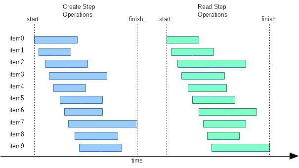
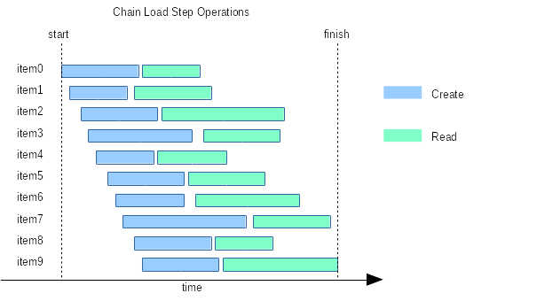
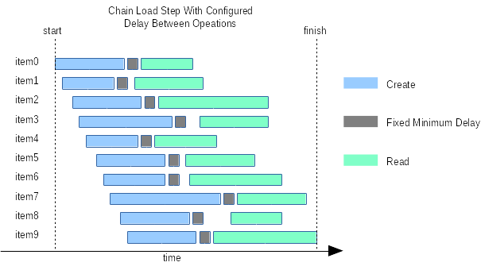

# Introduction

The basic load step executes the same type of operation for each item
supplied by the input. It's easy to execute several types of operations
by executing a sequence of the load steps:

However, sometimes it's necessary to execute the different types of
operations on the items asynchronously (e.g. each item traverses through
the "pipeline" of load operations):

Additional useful possibility is to sustain some fixed delay between
the operations in the pipeline:

# Limitations

1. The count of the items which may be temporarily stored in the
exchange buffer is limited in order to avoid the memory exhaustion.

2. In the distributed mode the system time on the hosts involved in the
test should be synchronized precisely if the delay between operations is
used.

3. There are the configuration parameters which are shared by the
pipeline step's load contexts and may not be set independently:
   * `load-step-id`
   * `load-step-limit-time`
The values for these parameters are taken from the ***1st***
configuration element of the pipeline load step.

4. The `item-output-file` configuration parameter value is taken from
the ***last*** configuration element of the pipeline load step.

# Requirements

1. Execute the sequence of the configured load operations on the items
asynchronously.

2. Drop the corresponding item from the pipeline if the load operation
failed. E.g. if a pipeline consists of two operations (Create, Read) the
items which are not *created* successfully don't pass for the subsequent
*reading*.

3. Support the configurable minimum delay between the operations on the
same item in the operations pipeline.

# Design

The pipeline step is implemented as a sequence of the separate load
contexts interconnected with the volatile memory FIFO buffer. This
buffer acts as a load operations result output for the previous load
context in the sequence and as an items input for the next load
context. To support the configurable transfer delay
([Req.3](#Requirements)) the buffer contains the load operations results which
contain the information about the corresponding load operation finish time.

The following rules work while the next load context requests the buffer for the new items:
1. Retain every load operation result if its finish time is later than the current time minus the configured delay.
2. If the load operation result is not retained by rule (1) it is converted to the corresponding item and yielded to the load
context requested the next batch of items.

# Configuration

1. `item-output-delay`

The minimum delay between the subsequent operations for each item.
0 (default value) means no delay. Accepts a time value (0, 1, "2s",
"3m", "4h").

2. `storage-driver-queue-output`

The count limit for the items which may be temporarily stored in the
exchange buffer is limited in order to avoid the memory exhaustion.
Default value is 1,000,000.

# Reporting

TODO
